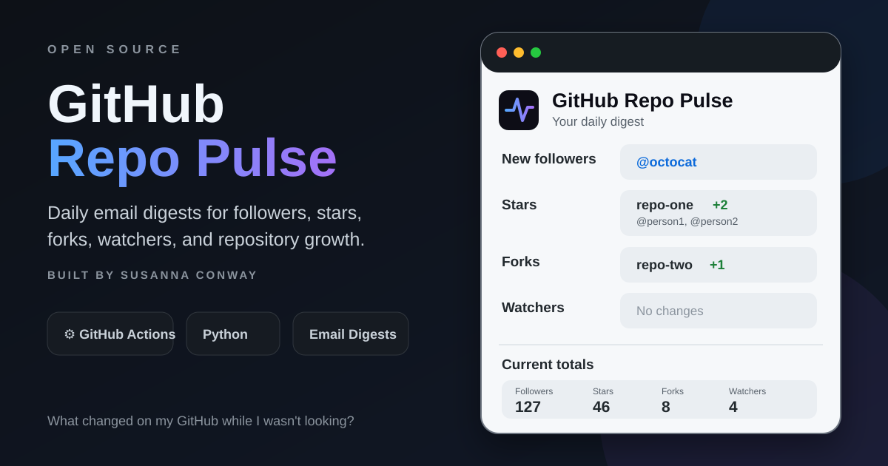

# GitHub Repo Pulse



Daily email digests for GitHub followers, stars, forks, watchers, and repository growth.

Built by [Susanna Conway](https://github.com/ohsusannamarie) because GitHub somehow forgot to notify us when people actually engage with our work.

GitHub exposes this engagement data through its API, but does not provide a simple built-in notification stream for all of it. GitHub Repo Pulse fills that gap with a lightweight Python script and GitHub Actions workflow.

## What it tracks

- New GitHub followers
- New repository stars
- New forks
- New repository watchers/subscribers
- Current totals across your profile and owned repositories
- Usernames for new activity when GitHub exposes them through the API

## How it works

1. GitHub Actions runs the monitor on a schedule.
2. `monitor.py` queries the GitHub REST API.
3. The current state is compared with `data/state.json`.
4. New activity is grouped into a single email digest.
5. The latest state is committed back to the repository for the next comparison.

## Quick start

### 1. Use this repository

Create your own copy of this repository. If this repository is enabled as a GitHub template, click **Use this template**. Otherwise, fork or clone it.

The workflow automatically monitors the GitHub account that owns your copy unless you set a different username.

### 2. Create a GitHub token

Create a fine-grained personal access token under:

**GitHub Settings > Developer settings > Personal access tokens > Fine-grained tokens**

Give it access to the repositories you want to monitor and the minimum read permissions required for repository metadata and follower/activity data.

Copy the token when GitHub shows it. You will add it as a repository secret in the next step.

### 3. Create a Resend API key

Create an account at Resend and generate an API key.

For production use, configure a sender/domain you control in Resend. Resend's `onboarding@resend.dev` sender is useful for initial testing but may be restricted to the address associated with your Resend account.

### 4. Add repository secrets

Open your copy of this repository and go to:

**Settings > Secrets and variables > Actions > Secrets**

Add:

| Secret | Purpose |
| --- | --- |
| `MONITOR_GITHUB_TOKEN` | Fine-grained GitHub token used by the monitor |
| `RESEND_API_KEY` | Resend API key |
| `ALERT_EMAIL` | Email address that receives the digest |
| `FROM_EMAIL` | Sender configured in Resend, for example `GitHub Repo Pulse <pulse@yourdomain.com>` |

`FROM_EMAIL` is optional in the code, but the default Resend onboarding sender may not work for every account. Setting your own verified sender is recommended.

### 5. Optional repository variables

Under:

**Settings > Secrets and variables > Actions > Variables**

You can add:

| Variable | Default | Purpose |
| --- | --- | --- |
| `GITHUB_USERNAME` | Repository owner | Monitor a different public GitHub username |
| `SEND_QUIET_DIGEST` | `true` | Set to `false` to email only when something changes |
| `DIGEST_TITLE` | `GitHub Repo Pulse` | Customize the email heading and subject |

### 6. Run it once

Go to:

**Actions > GitHub Repo Pulse > Run workflow**

The first successful run creates your baseline in `data/state.json` and intentionally does not send an email.

After that, each run compares the current GitHub state with the previous successful snapshot.

## Default schedule

The included workflow runs daily at:

```yaml
- cron: "0 11 * * *"
```

GitHub Actions uses UTC, so `11:00 UTC` is 7:00 AM Eastern during daylight saving time.

You can edit `.github/workflows/monitor.yml` to use any GitHub Actions cron schedule you prefer.

## Example digest

A typical email might look like:

```text
GitHub Repo Pulse: 4 new signals

New followers
@octocat

Stars
repo-one +2
@person1, @person2

Forks
repo-two +1

Watchers
No changes

Current totals
Followers  127
Stars       46
Forks        8
Watchers     4
```

Quiet-day emails can also be enabled so you know the automation is still running even when nothing changed.

## Project structure

```text
.github/
  workflows/
    monitor.yml

data/
  state.json

monitor.py
README.md
LICENSE
```

## GitHub API terminology

GitHub's repository metadata naming can be confusing:

| API field | Meaning |
| --- | --- |
| `stargazers_count` | Stars |
| `watchers_count` | Also stars |
| `subscribers_count` | Actual repository watchers |

GitHub Repo Pulse uses `subscribers_count` for real watchers.

## Privacy and security

- API keys and tokens belong in GitHub Actions secrets, never in committed files.
- `data/state.json` stores public GitHub usernames and repository engagement data so the workflow can identify changes between runs.
- If you would rather not expose that state publicly, keep your implementation private or adapt the workflow to store state somewhere else.

## Current features

- Daily GitHub engagement monitoring
- Email digest delivery
- Follower tracking
- Star tracking
- Fork tracking
- Repository watcher tracking
- Username attribution when available
- Current engagement totals
- Optional quiet-day emails
- Automatic state persistence
- Manual workflow execution
- Reusable configuration for other GitHub users

## Ideas for future versions

- Weekly and monthly growth summaries
- Repository growth rates
- Most active repositories
- Seven-day and thirty-day deltas
- GitHub traffic and clone metrics
- Referral source tracking
- Trending repository detection
- Historical charts
- Lightweight dashboard

## License

MIT

---

Built to answer a simple question GitHub makes surprisingly hard:

**What changed on my GitHub while I wasn't looking?**
